# Manual de Usuario — Turesma SCIGA

**Sistema de Control de Ingresos y Gastos Administrativos**

---

## Índice

1. [Inicio de Sesión](#1-inicio-de-sesión)
2. [Dashboard](#2-dashboard)
3. [Socios](#3-socios)
4. [Clientes](#4-clientes)
5. [Facturas](#5-facturas)
6. [Liquidaciones](#6-liquidaciones)
7. [Tipos de Retención](#7-tipos-de-retención)
8. [Movimientos de Caja](#8-movimientos-de-caja)
9. [Aportes de Socios](#9-aportes-de-socios)
10. [Usuarios del Sistema](#10-usuarios-del-sistema)
11. [Configuración (Logo)](#11-configuración-logo)
12. [Reportes](#12-reportes)

---

## 1. Inicio de Sesión

**URL:** `/login`

Pantalla de acceso con diseño oscuro y el branding **Turesma** en rojo.

### Campos
| Campo | Descripción |
|---|---|
| Correo electrónico | Email del usuario registrado |
| Contraseña | Contraseña del usuario |

### Acciones
- **Iniciar Sesión**: valida las credenciales. Si son correctas redirige al Dashboard. Si fallan muestra "Credenciales incorrectas."
- **Cerrar Sesión**: disponible en el menú lateral.

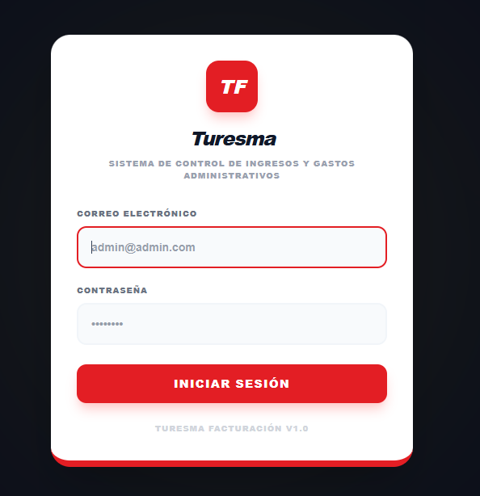

---

## 2. Dashboard

**URL:** `/dashboard`

Panel principal con indicadores y gráficos del negocio.

### Filtros
En la parte superior hay selectores de **Mes** y **Año** para filtrar los datos. Al cambiar cualquiera, la página se actualiza automáticamente.

### Indicadores KPI
| Indicador | Color | Descripción |
|---|---|---|
| Valor Recibido | Verde | Total de ingresos del período |
| Total Gastos | Rojo | Suma de egresos del período |
| Total Dinero | Negro | Efectivo disponible |
| Facturas Emitidas | Azul | Cantidad de facturas |
| Socios Activos | Rojo | Socios marcados como activos |

Cuando se selecciona un mes específico, se muestran variaciones porcentuales respecto al mes anterior (flecha verde = subió, roja = bajó). Sin filtro muestra sumas acumuladas de todo el año.

### Gráficos
1. **Evolución Mensual** — línea: Valor Recibido, Gastos y Total Dinero por mes
2. **Distribución del Dinero** — dona: Gastos, Cuota Admin, Retenciones, Saldo
3. **Top Socios por Valor Recibido** — barras horizontales (top 10)
4. **Comparativa Mensual** — barras: Valor Recibido vs Total Dinero

### Botón Reportes
Menú desplegable con acceso a:
- Reporte Mensual
- Reporte Anual
- Situación Financiera

Cada uno con 3 opciones: Vista Previa, Descargar PDF, Imprimir.

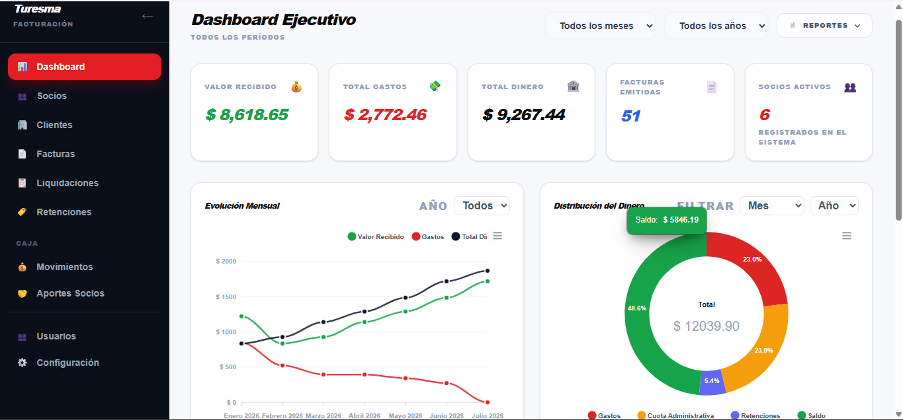

---

## 3. Socios

### Listado

**URL:** `/socios`

Tabla con todos los socios registrados.

| Columna | Descripción |
|---|---|
| Nombre | Nombre completo |
| Identificación | Documento de identidad |
| Teléfono | Número de contacto |
| Cuota Base | Cuota mensual en dólares |
| Tipo | Socio o Colaborador |
| Facturas | Conteo de facturas asociadas |
| Aportes | Conteo de aportes |
| Estado | Activo (verde) o Inactivo (rojo) |
| Acciones | Editar / Eliminar |

### Crear o Editar

**URLs:** `/socios/crear`, `/socios/{id}/editar`

| Campo | Requerido | Detalle |
|---|---|---|
| Nombres | Sí | Máx. 255 caracteres |
| Identificación | Sí | Máx. 50, único en el sistema |
| Teléfono | No | Máx. 20 |
| Email | No | Con formato de email |
| Dirección | No | Máx. 500 |
| Cuota Mensual Base | No | Mín. $0 |
| % Participación | No | Entre 0 y 100 |
| Tipo de Socio | Sí | Socio o Colaborador |
| Activo | No | Marcado por defecto |

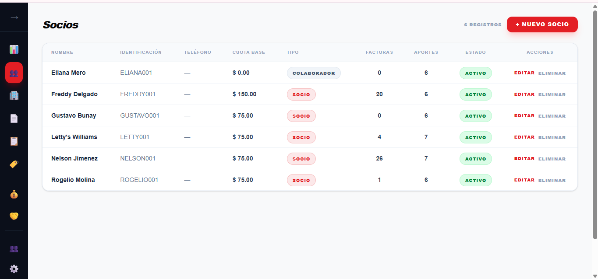
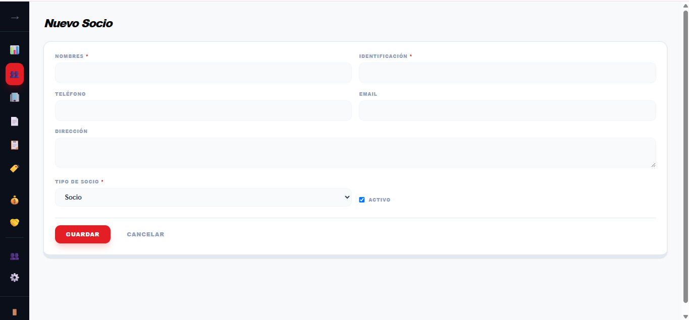

---

## 4. Clientes

### Listado

**URL:** `/clientes`

| Columna | Descripción |
|---|---|
| Razón Social | Nombre comercial |
| RUC | Registro único (único en sistema) |
| Contacto | Persona de contacto |
| Teléfono | Número |
| Email | Correo |
| Facturas | Conteo de facturas |
| Estado | Activo/Inactivo |
| Acciones | Editar / Eliminar |

### Crear o Editar

| Campo | Requerido | Detalle |
|---|---|---|
| Razón Social | Sí | Máx. 255 |
| RUC | Sí | Máx. 20, único |
| Contacto | No | Máx. 255 |
| Teléfono | No | Máx. 20 |
| Email | No | Máx. 255 |
| Dirección | No | Máx. 500 |
| Activo | No | Marcado por defecto |

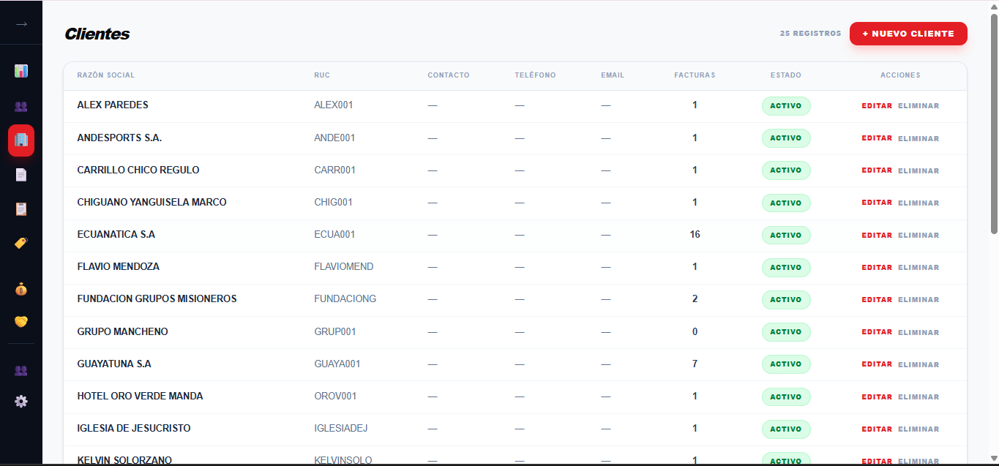
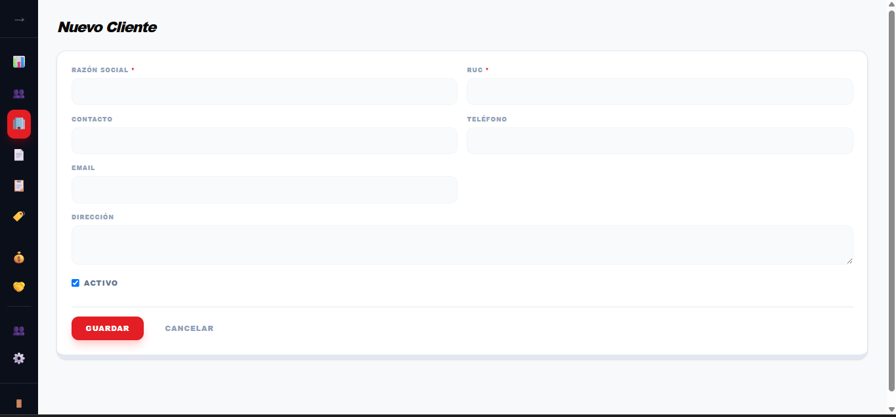

---

## 5. Facturas

### Listado

**URL:** `/facturas`

#### Filtros
- Socio, Cliente, Estado, Año, Mes
- Al cambiar el año, los meses disponibles se cargan automáticamente

#### Columnas
| Columna | Descripción |
|---|---|
| # Factura | Número único |
| Fecha | dd/mm/aaaa |
| Socio | Nombre del socio |
| Cliente | Razón social |
| Valor Bruto | Monto total |
| Ret. Pers. | Bruto - Recibido (retenciones personales) |
| V. Recibido | Neto después de retenciones personales |
| Ret. Turesma | Retención de turismo 3% |
| Valor Neto | Recibido - Turesma |
| Estado | Pendiente, Pagado, Anulado |
| Acciones | Editar / Eliminar |

Cada fila se puede expandir para ver el detalle de las retenciones personales (distribuciones).

### Crear o Editar

**URLs:** `/facturas/crear`, `/facturas/{id}/editar`

#### Datos de la factura
| Campo | Requerido | Detalle |
|---|---|---|
| Número Factura | Sí | Único, máx. 50 |
| Fecha Emisión | Sí | |
| Socio | Sí | Solo activos |
| Cliente | Sí | Solo activos |
| Valor Bruto | Sí | Mín. $0 |
| Valor Recibido | — | **Solo lectura**, se calcula automáticamente |
| Estado | Sí | Pendiente, Pagado, Anulado |
| Observación | No | Máx. 1000 |

#### Retención Turesma (3%)
Sección para registrar la retención de turismo:
- **Tipo**: selecciona "Retención Turismo 3%" (o crea uno nuevo)
- **%**: se precarga según el tipo seleccionado
- **Base**: se precarga con el Valor Recibido
- **Valor**: se calcula como Base × % / 100

#### Retenciones Personales (Distribuciones)
Deducciones del socio sobre la factura:
- **Tipo**: selecciona el tipo de retención
- **%**: porcentaje a aplicar
- **Base**: se precarga con Valor Bruto
- **Observación**: texto libre
- **Valor**: monto de la deducción

#### Cálculo automático
```
Valor Recibido = Valor Bruto — suma de valores de distribuciones con % > 0
```

El campo Valor Recibido es de solo lectura y se recalcula al cambiar el Bruto o cualquier distribución.

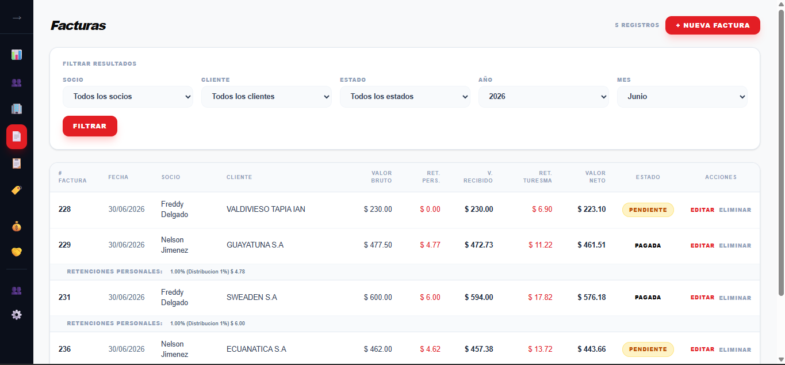
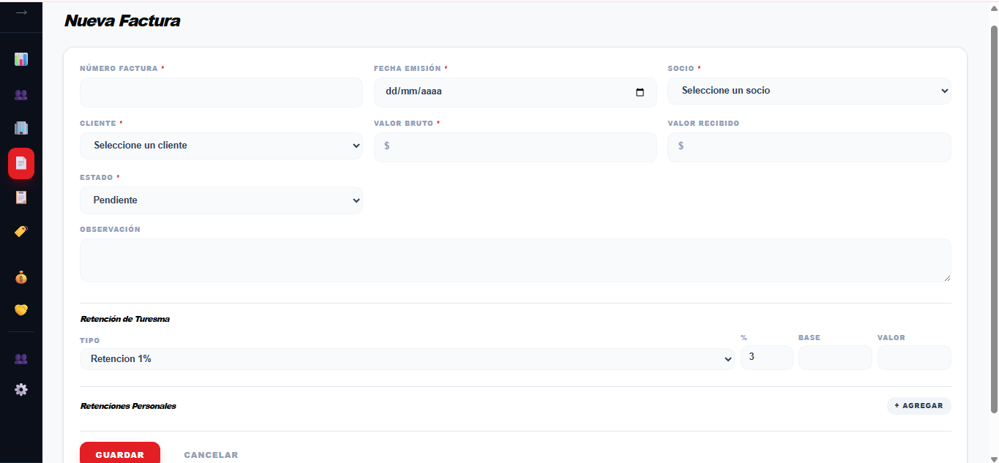

---

## 6. Liquidaciones

### Listado

**URL:** `/liquidaciones`

#### Filtros
- Socio, Mes, Año

#### Columnas
| Columna | Descripción |
|---|---|
| # | ID de liquidación |
| Socio | Nombre del socio |
| Período | Mes y año |
| Total Facturado | Suma de valores brutos |
| Total Retenciones | Suma de retenciones |
| Total Neto | Facturado - retenciones - distribuciones |
| Facturas | Lista de facturas incluidas |
| Estado | Borrador, Emitido, Aprobado, Cerrado |
| Acciones | Editar / Eliminar |

**Nota:** Las liquidaciones "calculadas" (automáticas) se muestran en el listado pero no tienen botones de acción. Solo las guardadas manualmente se pueden editar/eliminar.

### Generar Liquidación

**URL:** `/liquidaciones/crear`

1. Seleccionar **Socio**, **Mes** y **Año**
2. El sistema carga dos tablas:
   - **Facturas Disponibles**: con checkbox para seleccionar
   - **Facturas Ya Liquidadas**: solo lectura
3. Marcar las facturas a incluir (o usar "Seleccionar todo")
4. Click **"Generar Liquidación"**

La liquidación se crea en estado **Borrador**.

### Editar Estado

**URL:** `/liquidaciones/{id}/editar`

Solo se puede cambiar el **Estado** de la liquidación:
- Borrador → Emitido → Aprobado → Cerrado

Los montos y facturas no se modifican.

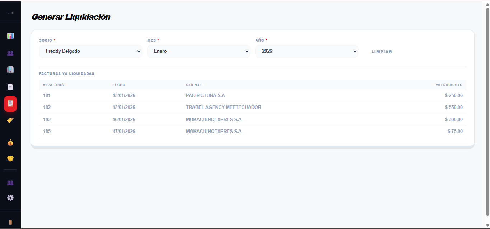
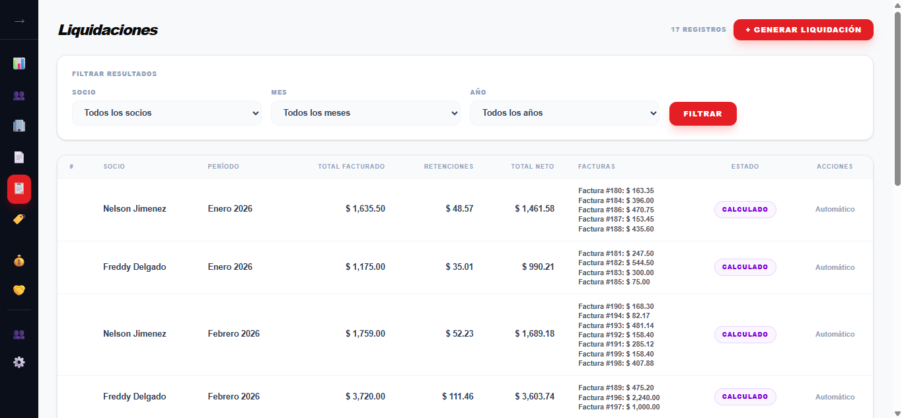

---

## 7. Tipos de Retención

### Listado

**URL:** `/tipos-retencion`

| Columna | Descripción |
|---|---|
| Nombre | Nombre del tipo |
| Slug | Identificador único (ej: `retencion-turismo-3`) |
| Porcentaje | % de retención |
| Descripción | Texto descriptivo |
| Estado | Activo/Inactivo |
| Acciones | Editar / Eliminar |

### Crear o Editar

| Campo | Requerido |
|---|---|
| Nombre | Sí (único) |
| Slug | No (se genera automáticamente) |
| Porcentaje | Sí (0-100) |
| Descripción | No |
| Activo | No |

**No se puede eliminar** un tipo que tenga facturas asociadas.

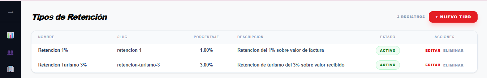

---

## 8. Movimientos de Caja

### Listado

**URL:** `/caja/movimientos`

#### Filtros
- Tipo (Ingreso, Egreso, Ajuste)
- Categoría
- Año, Mes

#### Columnas
| Columna | Descripción |
|---|---|
| Fecha | dd/mm/aaaa |
| Tipo | Ingreso (verde), Egreso (rojo), Ajuste (amarillo) |
| Categoría | Nombre |
| Descripción | Texto |
| Valor | Monto en $ |
| Estado | Activo |
| Acciones | Editar / Eliminar |

### Crear o Editar

**URLs:** `/caja/movimientos/crear`, `/caja/movimientos/{id}/editar`

| Campo | Requerido |
|---|---|
| Fecha | Sí |
| Tipo | Sí (Ingreso, Egreso, Ajuste) |
| Categoría | Sí (se puede crear una nueva desde el mismo formulario) |
| Valor | Sí (mín. 0) |
| Descripción | Sí (máx. 500) |

**Creación rápida de categoría:** al seleccionar "+ Nuevo" en el campo Categoría se abre un modal para crear una nueva categoría sin salir del formulario.

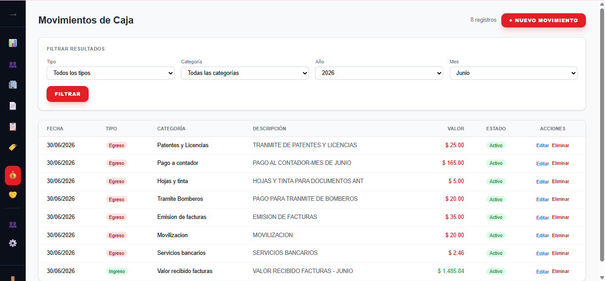
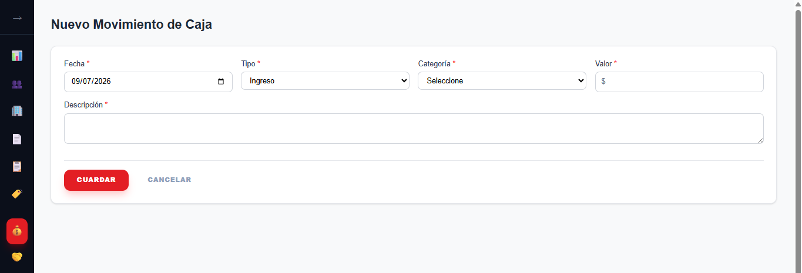

---

## 9. Aportes de Socios

### Listado

**URL:** `/caja/aportes`

#### Filtros
- Socio, Mes, Año, Estado

#### Columnas
| Columna | Descripción |
|---|---|
| Socio | Nombre del socio |
| Período | Mes y año |
| Valor Cuota | Monto |
| Fecha Pago | Fecha o "—" |
| Estado | Pagado (verde), Pendiente (amarillo), Cancelado (rojo), Exento (gris) |
| Acciones | Editar / Eliminar |

### Crear o Editar

| Campo | Requerido |
|---|---|
| Socio | Sí |
| Mes | Sí (1-12) |
| Año | Sí (2000-2100) |
| Valor Cuota | Sí (mín. 0) |
| Estado | Sí |
| Fecha Pago | No |
| Observación | No |

Solo los aportes en estado **Pagado** se contabilizan en los cálculos de cierre financiero y reportes.

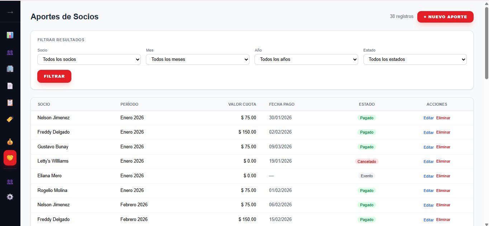
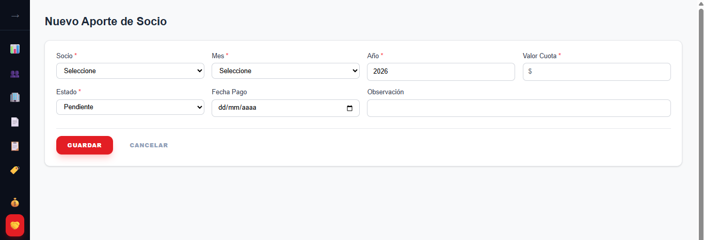

---

## 10. Usuarios del Sistema

### Listado

**URL:** `/usuarios`

| Columna | Descripción |
|---|---|
| Nombre | Nombre del usuario |
| Email | Correo (único) |
| Rol Principal | Nombre del rol |
| Socio Asociado | Socio vinculado |
| Activo | Sí/No |
| Acciones | Editar / Eliminar |

### Crear o Editar

| Campo | Requerido |
|---|---|
| Nombre | Sí |
| Email | Sí (único) |
| Contraseña | Sí al crear; opcional al editar (vacío = conserva la actual) |
| Rol Principal | No |
| Socio Asociado | No |
| Activo | No |

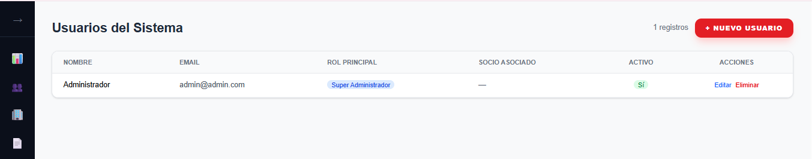
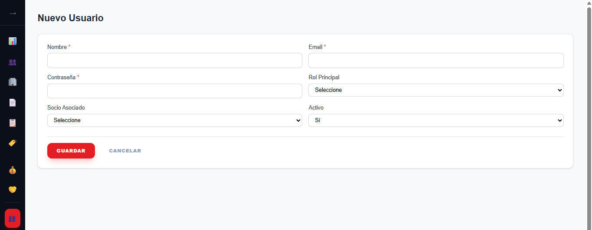

---

## 11. Configuración (Logo)

**URL:** `/configuracion`

Permite gestionar el logo que aparece en los reportes PDF.

### Subir Logo
- Arrastrar o hacer clic para seleccionar archivo
- Formatos: PNG, JPG, JPEG, WebP
- Tamaño máximo: 2MB

### Eliminar Logo
- Muestra el logo actual
- Enlace "Eliminar" con confirmación

**Nota:** Solo hay un logo a la vez. Subir uno nuevo reemplaza automáticamente el anterior.

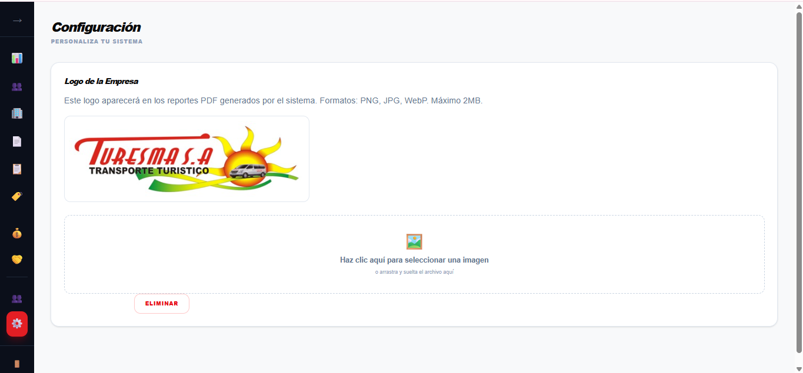

---

## 12. Reportes

### Reporte Mensual

**URL:** `/reportes/mensual/{año}/{mes}?mode=preview|pdf|print`

Muestra:
1. **Encabezado**: logo, nombre del sistema, período
2. **Resumen**: Valor Recibido, Total Gastos, Total Dinero
3. **Detalle de conceptos**: VR, Gastos, Saldo, Cuota Admin, Ret 3%, Total Dinero
4. **Socios del mes**: tabla con socio, cuota, fecha de pago
5. **Pagos del mes**: tabla con concepto y valor

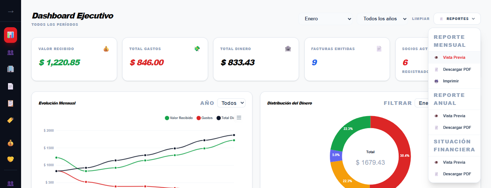

### Reporte Anual

**URL:** `/reportes/anual/{año}?mode=preview|pdf|print`

- Tabla resumen: 12 filas (una por mes) con VR, Gastos, Saldo, CA, Ret 3%, TD + totales
- Detalle de Socios y Pagos por cada mes

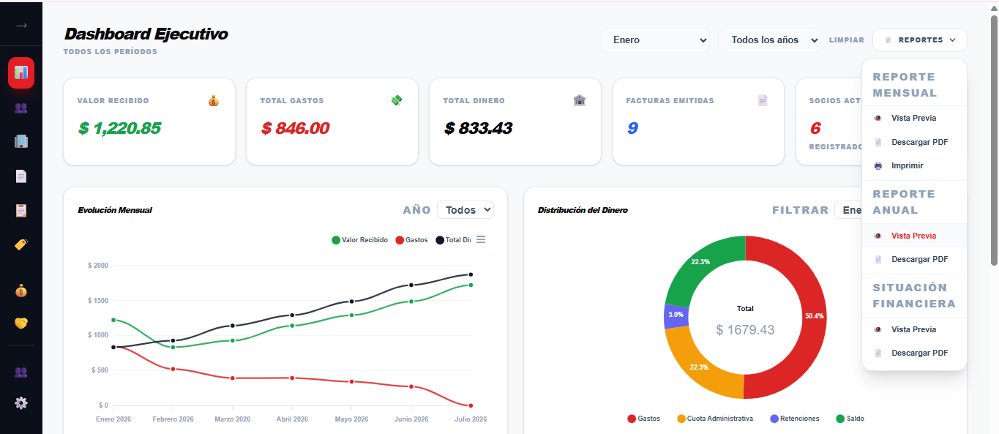

### Situación Financiera

**URL:** `/reportes/situacion-financiera?mode=preview|pdf|print`

- Resumen general de todos los períodos disponibles

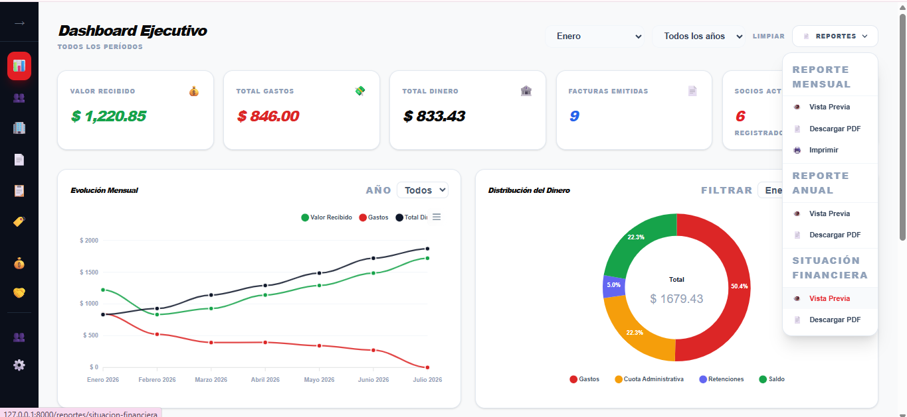
- Tabla completa con todos los meses
- Detalle de Socios y Pagos por período

### Cálculos Financieros

Los reportes se basan en el método `calcularCierres()` que sigue estas reglas:

| Concepto | Cálculo |
|---|---|
| Cuota Administrativa | Suma de aportes con estado `pagado` del período |
| Total Gastos | Suma de movimientos tipo `egreso` del período |
| Retención 3% | Suma de retenciones Turesma del período |
| Valor Recibido (mes 1) | CA + Gastos - $0.15 |
| Valor Recibido (meses siguientes) | Total Dinero del mes anterior (arrastre) |
| Saldo | VR - Gastos |
| Total Dinero | Saldo + CA + Ret 3% |

---

---

## Anexo: Agregar Imágenes al Manual

Para capturas de pantalla, guarda las imágenes en la carpeta `screenshots/` del proyecto y referéncialas así:

```markdown

```

Ejemplo:
```markdown


```

*Documento generado el 9 de julio de 2026*
